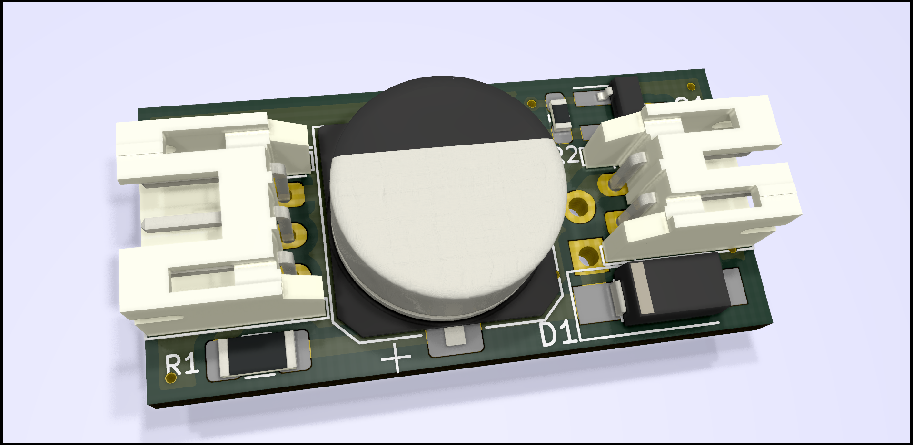
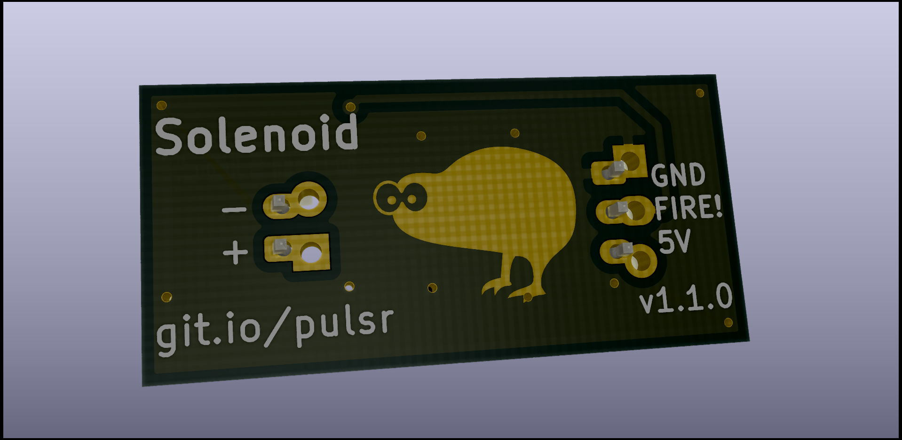

# Solenoid-shooter

***This doesn't seem to work all that well. More experimentation required.***

This tiny board is designed to handle quick pulses of current to a solenoid. It has a mosfet to trigger it, a capacitor for providing the pulse of current, and flyback diode, and an inrush limiting resistor. If fired at it's highest rate, the board should average out to ~100mA consumption

## Renders:

